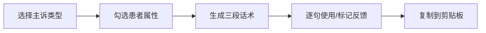
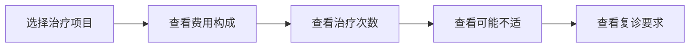
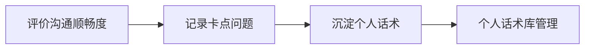

## 1. 产品概述

面向口腔门诊医生的 Web 接诊话术提示台，解决初诊沟通时表达不统一的问题。通过标准化接诊话术、治疗方案解释和复盘沉淀三大功能，帮助医生提升沟通效率和患者体验，同时保留医生个人风格。

- **核心目标**：降低医生表达不统一，提升初诊沟通效率与患者满意度
- **目标用户**：口腔门诊医生、接诊护士、诊所培训人员
- **市场价值**：提升诊所服务标准化，降低新医生培训周期，提升患者转化率

## 2. 核心功能

### 2.1 用户角色

| 角色 | 注册方式 | 核心权限 |
|------|----------|----------|
| 医生用户 | 本地使用（单页应用，无需注册 | 使用全部功能、个人话术库管理 |

### 2.2 功能模块

1. **初诊沟通话术**：主诉类型选择、患者属性勾选、三段式话术生成、逐句使用、话术标记反馈
2. **治疗方案解释卡**：治疗项目选择、费用/次数/不适/复诊患者化表达
3. **接诊后复盘**：沟通评价、卡点记录、个人话术沉淀

### 2.3 页面详情

| 页面名称 | 模块名称 | 功能描述 |
|----------|----------|----------|
| 主页面 | 顶部导航 | 三大功能模块切换、品牌标识 |
| 初诊沟通 | 主诉选择区 | 牙痛、缺牙、牙齿不齐、洗牙咨询四大类主诉类型卡片式选择 |
| 初诊沟通 | 患者属性区 | 年龄分段、紧张程度、是否首次到院三个维度勾选 |
| 初诊沟通 | 话术展示区 | 开场问候、病史追问、检查前三段话术卡片，逐句展示，点击复制使用 |
| 初诊沟通 | 话术反馈 | 句子标记"太生硬"或"需简化"，实时调整建议 |
| 治疗方案 | 项目选择区 | 根管、补牙、种植、正畸等治疗项目卡片选择 |
| 治疗方案 | 解释卡展示区 | 费用构成、治疗次数、可能不适、复诊要求四大模块患者化表达 |
| 接诊复盘 | 复盘表单 | 沟通是否顺利、患者卡点问题、个人话术保存到个人库 |
| 接诊复盘 | 个人话术库 | 展示沉淀的常用话术，可编辑管理 |

## 3. 核心流程

用户进入首页 → 选择功能模块（初诊沟通/治疗方案/接诊复盘）

### 初诊沟通流程：
选择主诉类型 → 勾选患者属性 → 系统生成话术 → 逐句点击使用或标记反馈

### 治疗方案解释流程：
选择治疗项目 → 查看四大模块解释 → 患者化表达辅助沟通

### 接诊复盘流程：
选择沟通顺畅度 → 选择/输入卡点问题 → 保存优质话术到个人库

## 4. 用户界面设计

### 4.1 设计风格
- **主色调**：专业医疗蓝 (#2563eb 为主色，搭配温暖牙白为背景
- **辅助色**：薄荷绿 (#10b981 用于成功/正向，珊瑚橙 (#f97316 用于提醒
- **按钮风格**：圆角矩形按钮，柔和阴影，悬停微动画
- **字体**：Noto Sans SC 中文无衬线字体，清晰易读
- **布局风格**：卡片式布局，左侧导航/顶部导航结合，模块分区清晰
- **图标风格**：线性图标，简洁现代，统一 24px

### 4.2 页面设计概览

| 页面名称 | 模块名称 | UI 元素 |
|----------|----------|----------|
| 主页面 | 顶部导航 | 品牌Logo、功能Tab切换、当前医生信息 |
| 初诊沟通 | 主诉选择区 | 四大主诉类型大卡片，图标+图标，选中态高亮 |
| 初诊沟通 | 患者属性区 | 标签式多选，年龄/紧张度/首次三列排列 |
| 初诊沟通 | 话术展示区 | 三段式卡片堆叠，句子逐行展示，悬停高亮，点击复制动效 |
| 治疗方案 | 项目选择区 | 治疗项目网格卡片，图标+名称 |
| 治疗方案 | 解释卡展示区 | 四大模块可折叠卡片，图标+标题+患者化文字 |
| 接诊复盘 | 复盘表单 | 评分选择、问题标签、话术输入框 |
| 接诊复盘 | 个人话术库 | 话术列表卡片，分类标签，编辑删除 |

### 4.3 响应式
- 桌面端优先设计，平板自适应
- 移动端适配平板端适配，触控优化
- 卡片式布局在小屏自动堆叠

### 4.4 动效设计
- 页面加载淡入动画
- 卡片悬停微上浮阴影加深
- 句子点击复制成功动效
- Tab切换平滑过渡
