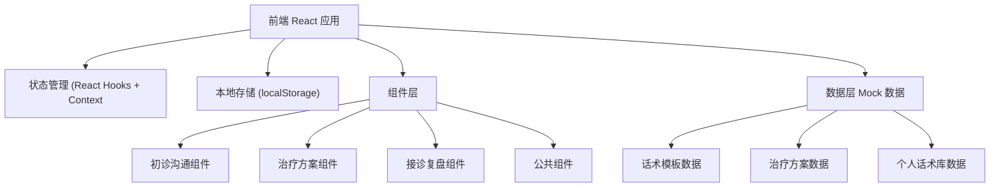
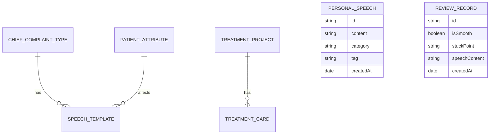

## 1. 架构设计



## 2. 技术描述

- **前端**: React@18 + TypeScript + tailwindcss@3 + vite
- **初始化工具**: vite-init
- **后端**: 无后端，纯前端单页应用
- **数据存储**: localStorage 本地持久化
- **图标**: lucide-react
- **状态管理**: React Hooks (useState, useEffect, useContext)

## 3. 路由定义

| 路由 | 用途 |
|------|------|
| / | 首页，默认展示初诊沟通模块 |
| /consultation | 初诊沟通话术模块 |
| /treatment | 治疗方案解释卡模块 |
| /review | 接诊后复盘模块 |

## 4. 数据模型

### 4.1 数据模型定义



### 4.2 数据类型定义

```typescript
// 主诉类型
type ChiefComplaintType = 'toothache' | 'missing_tooth' | 'malocclusion' | 'cleaning';

// 患者属性
interface PatientAttributes {
  ageGroup: 'child' | 'teen' | 'adult' | 'senior';
  anxietyLevel: 'low' | 'medium' | 'high';
  isFirstVisit: boolean;
}

// 话术段落类型
type SpeechSection = 'greeting' | 'medical_history' | 'pre_exam';

// 话术项
interface SpeechItem {
  id: string;
  content: string;
  section: SpeechSection;
  tags: string[];
}

// 治疗项目类型
type TreatmentType = 'root_canal' | 'filling' | 'implant' | 'orthodontics';

// 治疗方案卡片
interface TreatmentCard {
  type: TreatmentType;
  name: string;
  costBreakdown: string[];
  treatmentSessions: string;
  possibleDiscomfort: string[];
  followUpRequirement: string[];
}

// 个人话术
interface PersonalSpeech {
  id: string;
  content: string;
  category: string;
  tags: string[];
  createdAt: number;
}

// 复盘记录
interface ReviewRecord {
  id: string;
  isSmooth: boolean;
  stuckPoint: string;
  speechContent: string;
  createdAt: number;
}
```

## 5. 组件结构

```
src/
├── components/
│   ├── layout/
│   │   ├── Header.tsx        # 顶部导航
│   │   └── TabNav.tsx        # 功能Tab切换
│   ├── consultation/
│   │   ├── ComplaintSelector.tsx  # 主诉选择
│   │   ├── PatientAttributes.tsx  # 患者属性
│   │   ├── SpeechCard.tsx        # 话术卡片
│   │   └── SpeechItem.tsx        # 单条话术
│   ├── treatment/
│   │   ├── TreatmentSelector.tsx # 治疗项目选择
│   │   └── TreatmentCard.tsx     # 治疗解释卡
│   └── review/
│       ├── ReviewForm.tsx        # 复盘表单
│       └── SpeechLibrary.tsx     # 个人话术库
├── data/
│   ├── speeches.ts         # 话术模板数据
│   └── treatments.ts       # 治疗方案数据
├── hooks/
│   └── useLocalStorage.ts  # localStorage Hook
├── types/
│   └── index.ts            # 类型定义
├── App.tsx
├── main.tsx
└── index.css
```
